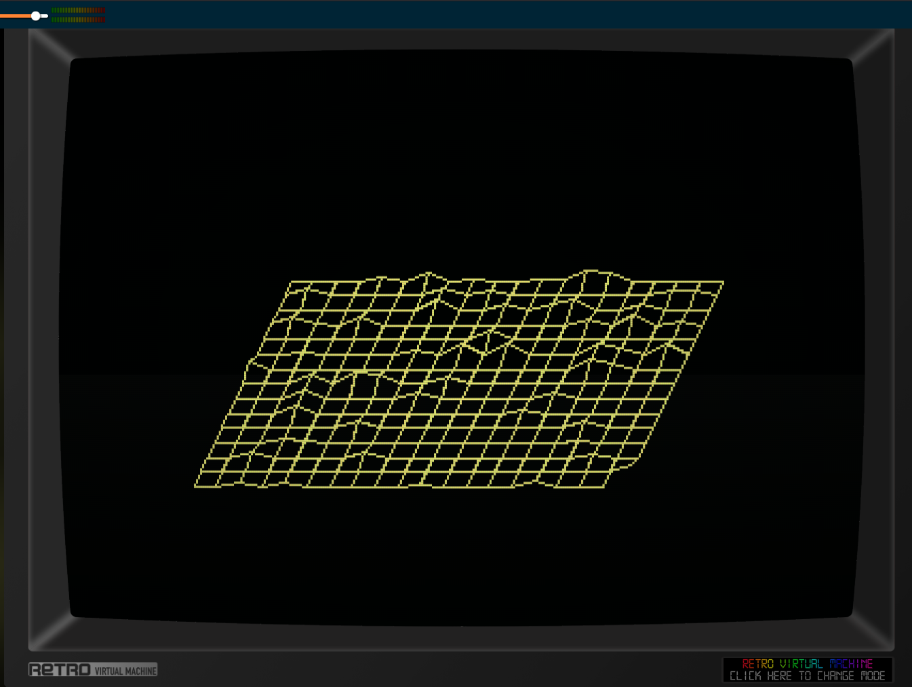

# symsav-mountain

A 3D isometric terrain screensaver for [SymbOS](https://www.symbos.org/) on the Amstrad CPC.

> **Requires Mode 1** — this screensaver only works in 320×200 Mode 1 (4 colours). Running it in any other screen mode will produce incorrect output.

Inspired by Pascal Pensa's `mountain` module from the [xlockmore](https://www.tux.org/xlockmore/) / xscreensaver suite (1995).

---

## Building

```bash
./build.sh
```

Requires the SCC compiler (set `SCC=` env var if not at `../scc/bin/cc`) and Python 3.

Build steps:

1. SCC compiles `mountain.c` → `mountain.sav`
2. `add_preview.py` patches the preview thumbnail into the binary at file offset 256

Output: `mountain.sav`

---

## Installing

1. Copy `mountain.sav` into your `C:\SYMBOS\` directory.
2. Open **Display Properties** and go to the **Screen Saver** tab.
3. Click **Browse** and select `mountain.sav`.
4. Click **Setup** to configure the effect:
   - **Speed**: Slow / Normal / Fast — controls how many grid cells are drawn per tick
   - **Peaks**: Few / Normal / Many — number of random height peaks seeded into the terrain

---

## Effect

- A 20×20 terrain height map is generated by scattering random peaks and smoothing them twice with a neighbourhood spread/average pass, then adding a small amount of micro-noise.
- The terrain is projected onto the full 320×200 screen using the same isometric formula as the original `mountain.c` and drawn as a wireframe grid, one cell at a time from back to front.
- Cell edges are coloured by the average height of their four corners:

| Height range | Ink | Appearance |
|---|---|---|
| Low (valley floors) | 2 (dim) | dark lines |
| Mid (hillsides) | 3 (bright) | bright lines |
| High (peaks) | 0 (white) | white / snow lines |

- After the full grid is drawn, the terrain is held on screen for a few seconds, then cleared and a new random landscape is generated.

---

## Screensaver protocol

Standard SymbOS screensaver messages:

| Message | Action |
|---------|--------|
| `MSC_SAV_INIT` (1) | Load saved config from manager |
| `MSC_SAV_START` (2) | Start fullscreen animation |
| `MSC_SAV_CONFIG` (3) | Open config dialog |
| `MSR_SAV_CONFIG` (4) | Send updated config back |

Config is 6 bytes: magic `"MNTN"` + speed byte + peaks byte.

---

## Animation

Fullscreen rendering follows the same approach as [symsav-xroach](https://github.com/salvogendut/symsav-xroach) and [symsav-xmatrix](https://github.com/salvogendut/symsav-xmatrix):

1. Open a fullscreen `WIN_NOTTASKBAR | WIN_NOTMOVEABLE` window
2. `DSK_SRV_DSKSTP` to freeze the desktop
3. Clear all 8 CPC character planes via `Bank_Copy` to VRAM (bank 0, all bytes = `0xF0` = ink 1 = black)
4. Per tick: draw N terrain cells using a Bresenham line algorithm with per-pixel `Bank_Copy` into VRAM
5. After every `Idle()`: call `vram_restore_lower()` to repair any interrupt-written blocks
6. Exit on any key or mouse movement: resume desktop, close window, `Screen_Redraw()`

### VRAM corruption and the shadow buffer

The SymbOS kernel writes 8×8 char-cell blocks into VRAM rows 12–24 (y = 96–199) during and around every `Idle()` call, even after `DSK_SRV_DSKSTP`. Because the terrain is drawn once per cell rather than redrawn every frame, these blocks accumulate visibly.

The fix is a **write-through shadow buffer** (`lbuf`, 8320 bytes in the `_data` segment):

- All pixels written at y ≥ 96 (char row 12+) update `lbuf` first, then copy from `lbuf` to VRAM — never reading back from VRAM.
- After every `Idle()`, `vram_restore_lower()` writes the full `lbuf` back to VRAM rows 12–24, overwriting whatever the interrupt deposited.
- Because `lbuf` contains only the screensaver's own pixels (never contaminated by a VRAM read), any interrupt corruption during a restore call is silently fixed on the next restore.
- During the regen cycle (screen clear + terrain init), `vram_restore_lower()` is called immediately after each expensive operation so corruption doesn't linger for multiple seconds.

Pixels above y = 96 use the standard read-modify-write path (one `Bank_Copy` read + one write per pixel) since the upper half is not affected by the interrupt.

VRAM address formula for pixel (x, y):

```
addr = 0xC000 + (y/8)*80 + (y%8)*0x800 + x/4
```

Mode-1 pixel encoding within each byte (4 pixels per byte):

```
bit7=p0_lo  bit6=p1_lo  bit5=p2_lo  bit4=p3_lo
bit3=p0_hi  bit2=p1_hi  bit1=p2_hi  bit0=p3_hi
```

Isometric projection (adapted from the original `mountain.c`):

```
x2 = gx * (2*320) / (3*20)
y2 = gy * (2*200) / (3*20)
screen_x = (x2 - y2/2) + 80
screen_y =  y2 - height + 70
```
